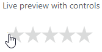

# StarGlide

**StarGlide** — a small, focused React rating-stars library with **smooth fractional hover** (you can get values like `1.5`, `2.3`, `4.5` by moving the pointer across the icons).  
Written in TypeScript, tested with Vitest, and designed so styles are injected once (no duplicate CSS when using many instances).



[Full Demo here](https://starglide.changebyweb.com/ "Full StarGlide Demo here")

---

## ⚡ Highlights

- Fractional hover (live rating while moving the pointer)
- Partially-filled star visuals implemented with layered backgrounds
- Small, dependency-light runtime
- TypeScript types, ESM + CJS builds supported
- Main props: `rating`, `readOnly`, `staleOnClick`, `showTooltip`, `ratingTitle`, `fillColor`, `iconsCount`, `size`, and callback hooks

---

## Installation (for library consumers)

This is a library — to use it in your project install it from npm:

```bash
npm install @jamesmove/star-glide
```
```bash
yarn add @jamesmove/star-glide
```

### Peer dependencies (install in the consuming project):

- `react`
- `react-dom`
- `react-bootstrap` (if you want the tooltip feature)

    Note: The ```dev``` scripts (```npm run prev```, ```npm run dev```, ```npm run build```, etc.) are only available in the library repository (development environment). They are not part of the package consumed via npm.

---

## Quick usage

Important: StarGlide expects the host container element with the id you pass as containerKey to exist in the DOM before the component mounts.

```tsx
// quick usage:
import { StarGlide } from '@jamesmove/star-glide';
import '@jamesmove/star-glide/style.css'

<div id="sg-host">
    <StarGlide containerKey="sg-host" rating={2.3} />
</div>
```

---

## Props / API

The only required prop is `containerKey`. It represent the id of the host container for the starGlide component

| Props      | Description | Type      | Default | Required      |
| ----------- | ----------- | ------      | ------      | ------      |
|`containerKey`  | The `id` (just the value without any #) of the container of the star-glide component.| string      | undefined | ✅  |
|`fillColor`  | The rating value of the star-glide component.        | string      | "" | ❌      |
|`rating`  | The rating value of the star-glide component.        | number      | 0 | ❌      |
|`iconsCount`  | The desire number of icons of the star-glide component.       | number      | 5 | ❌      |
|`size`  | The width in pixel of one star element for the star-glide container.        | number      | 14 | ❌      |
|`onPointerLeave`  | Callback that fire when the user pointer leave the star-glide component        | (rating: number, size: number, maxIcons: number) => void      | () => {} | ❌      |
|`onPointerClick`  | Callback that fire when the user pointer click on a value of the star-glide component.       | (rating: number, size: number, maxIcons: number) => void      | () => {} | ❌      |
|`onPointerMove`  |  Callback that fire when the user move the pointer accross the star-glide component.        | (rating: number, size: number, maxIcons: number) => void      | () => {} | ❌      |
|`className`  | The string className definie here will be apply on the first container of the star-glide component.        | string      | "" | ❌      |
|`showTooltip`  | Show or not a tooltip of the current rating value on hover or not.       | boolean      | true | ❌      |
|`transition`  | Define wether the star-glide component will be editable after click on a value or not.        | boolean      | false | ❌      |
|`staleOnClick`  | Define wether the star-glide component will be editable or not.        | boolean      | false | ❌      |
|`readOnly`  | The title that will appear on hover of the star-glide component.       | boolean      | false | ❌      |
|`ratingTitle`  | The title that will appear on hover of the star-glide component.        | string      | "" | ❌      

### Behavior notes

-   `containerKey` must match an element id present in the page before StarGlide mounts.
`staleOnClick` — if true, after a click sets a rating, hover updates are suppressed until the triggerRating equals currentRating.
-   `readOnly` — when true (and rating > 0), interactive callbacks are suppressed.
-   `onPointerMove`, `onPointerClick`, `onPointerLeave` receive (rating: number, size: number, maxIcons: number).
    -   `rating` : has the same definition as rating prop of the component.   
    -   `size` : has the same definition as size prop of the component.   
    -   `maxIcons` : has the same definition as iconsCount prop of the component.  
    Note: All those three params for the callbacks are current value on `onMouseMove`, `onClick` or `onMouseLeave` on the component.
-   `fillColor` has only 7 colors available (`black`,`green`,`red`,`blue`,`yellow`,`orange`,`purple`). You can also provide their `hex` or `rgb` equivalents. If you don't provide a color or you set a one that is not listed here, the default `gold` color will be apply for your hovering stars.

---

## Viewport safety (important)

The component verifies whether the configured total star width (size * iconsCount) or star height would exceed the viewport (window) width/height. If it would exceed:

-   StarGlide logs an error describing the problem (tests assert this behavior).
-   The component falls back to safe/default dimensions so it renders without overflowing the viewport.
-   This behavior prevents broken UIs on very small screens.
    
    Note:  Despite all warnings, if the star width or height exceeds the viewport width or height, the StarGlide will prompt the default values for `size` and `iconsCount` and you will experience bad behaviors when using any available callbacks.

**Recommendation:** choose `size` and `iconsCount` such that `size * iconsCount` fits typical viewport widths you expect to support.

---

## Accessibility / Animation

StarGlide need you to import his css in other to works fine, you can also set a custom class name. It's also possible to change the default component title on hover.
Finally you got the possibility to apply a transition on hover.

1) **Accessibility**

If you want the library to work well don't forget to import css file. In addition you can set a custom title for the component.

StarGlide with custom title:
```tsx
// css imported with custom component title
import { StarGlide } from '@jamesmove/star-glide';
import '@jamesmove/star-glide/style.css';
<div id='sg-host-style'>
  <StarGlide containerKey="sg-host-style" ratingTitle="StarGlide with custom title" />
</div>
```

2) **Animation**

If you want full control you can setup a css class name that will be apply on main container. You can do it by specifying the class name in `className` prop. You can also enable the default transition by setting `transition` to `true`. This will slower hovering.

Here is how:
```tsx
// transition plus custom className
import { StarGlide } from '@jamesmove/star-glide';
import '@jamesmove/star-glide/style.css';
<div id='sg-host-animation'>
  <StarGlide containerKey="sg-host-animation" transition className="custom-class-name" />
</div>
```

---

## Troubleshooting

- Component returns null — ensure the DOM element with id === containerKey exists before the component mounts.
- Tooltip/portal errors in tests — call cleanup() before clearing document.body, and hide the tooltip (mouseLeave) before teardown in tests so react-bootstrap unmounts the portal.
- Component load but it's empty — make sure that you import the css file:
```tsx
import { StarGlide } from '@jamesmove/star-glide';
import '@jamesmove/star-glide/style.css'

<div id="sg-host-style">
    <StarGlide containerKey="sg-host-style" />
</div>
```
- Editor cannot resolve @/alias — ensure tsconfig.json has:
```json
{
  "compilerOptions": {
    "baseUrl": ".",
    "paths": { "@/*": ["src/*"] }
  }
}
```
and vite.config.ts contains the same alias mapping. Restart the editor TS server after changes.
  
    Note: For any unexpected behavior check out you browser console, in most cases main error will be log there.

---

## License
MIT © James Move